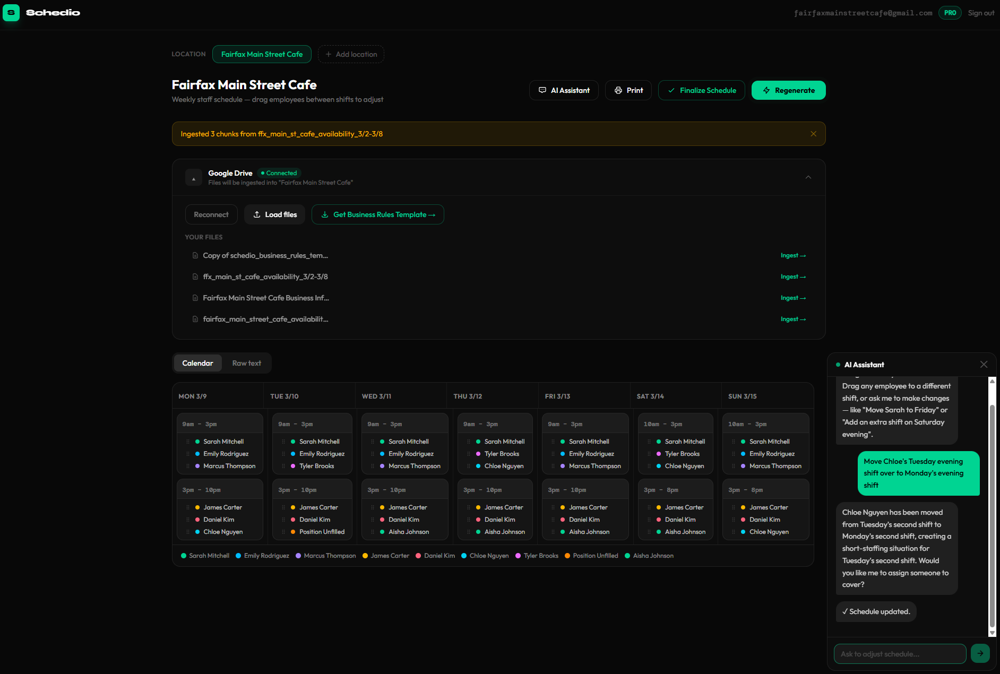

# TJ Kim — Developer Portfolio

Former restaurant operator turned cloud engineer. I build production-ready 
applications with a focus on AWS infrastructure, AI integration, and systems 
designed to scale.

---

## Projects

### Schedio — AI-Powered Staff Scheduling SaaS
> I spent years manually scheduling restaurant staff every Sunday night. 
> Spreadsheet open, stack of availability texts, too much coffee. 
> I built Schedio because I lived the problem.

**Live:** [schedio.cloud](https://schedio.cloud) — Free plan, no credit card required

### What it does
Schedio connects to Google Drive, reads employee availability, and generates 
a full weekly schedule using AI. Managers adjust shifts via drag-and-drop or 
by chatting with an AI assistant in natural language.

### Tech Stack
| Layer | Technology |
|---|---|
| Frontend | Next.js 14, Tailwind CSS, Vercel (edge CDN) |
| Backend | FastAPI (Python), SQLAlchemy |
| Database | Supabase (PostgreSQL + pgvector) |
| AI | OpenAI gpt-4o-mini, RAG pipeline, streaming chat |
| Infrastructure | AWS ECS Fargate, ALB, WAF, Route 53, Secrets Manager, ECR |
| IaC | Terraform — full stack deployable with a single `terraform apply` |
| CI/CD | GitHub Actions — build, push to ECR, deploy to ECS on every push to main |
| Payments | Stripe Checkout + Customer Portal |

### Highlights
- RAG architecture with intent detection — queries automatically routed to 
  the right context (availability vs. schedule history)
- Streaming AI chat — responses appear in real time, confirm/cancel flow 
  before any schedule change is applied
- Multi-tenant data scoping at the database level — all data isolated by 
  user_id + location_id
- LLM abstraction layer — swap between OpenAI and AWS Bedrock via a single 
  env variable
- Google Drive OAuth integration for availability ingestion
- Freemium model with three plan tiers enforced at the prompt, shift, and 
  database level
- 7+ production deployments

---

*More projects coming soon.*

---

### Contact
- LinkedIn: [linkedin.com/in/tae-joonkim](https://linkedin.com/in/tae-joonkim)
- Email: kim.taejoon@gmail.com
