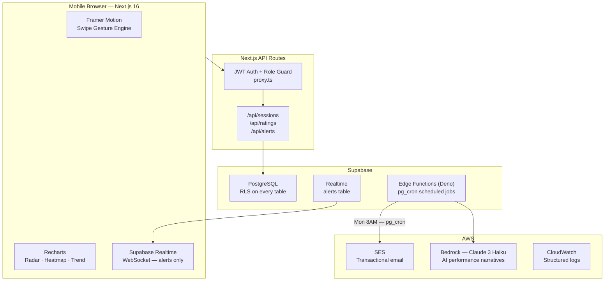
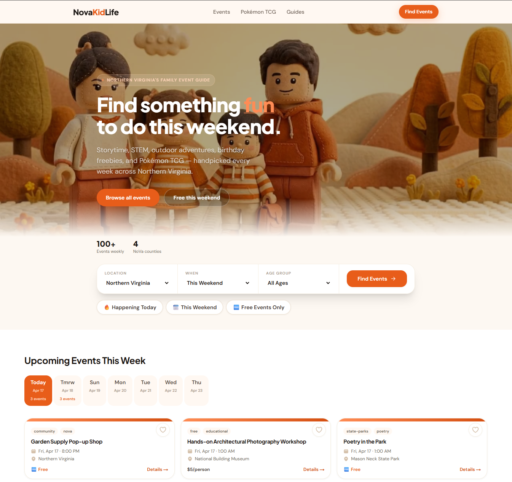
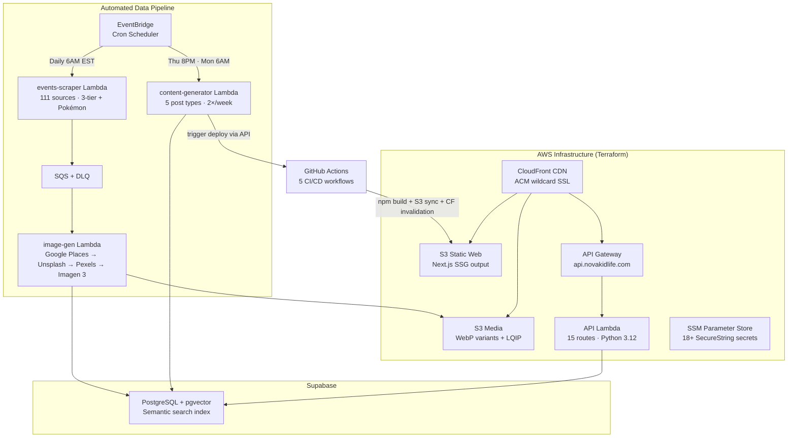
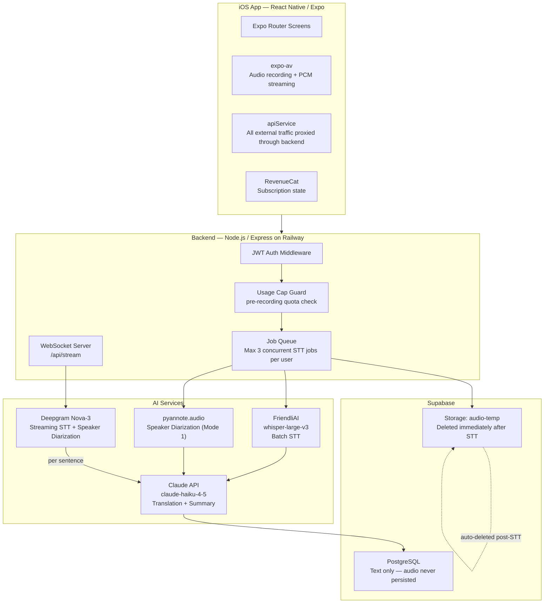

# TJ Kim

I went from running a restaurant to driving growth at SaaS companies to building cloud and AI systems. Not aspiring — already shipping. Everything I build is production-deployed, architecture-first, and designed to solve real problems for real users.

---

## Projects

---

### Schedio — AI-Powered Staff Scheduling SaaS

> I spent years manually scheduling restaurant staff every Sunday night. Spreadsheet open, stack of availability texts, too much coffee. I built Schedio because I lived the problem.

**Live:** [schedio.cloud](https://schedio.cloud) — Free plan, no credit card required

Schedio connects to Google Drive, reads employee availability, and generates a full weekly schedule using AI. Managers adjust shifts via drag-and-drop or by chatting with an AI assistant in natural language.

**Tech Stack**

| Layer | Technology |
|---|---|
| Frontend | Next.js 14, Tailwind CSS, Vercel (edge CDN) |
| Backend | FastAPI (Python), SQLAlchemy |
| Database | Supabase (PostgreSQL + pgvector) |
| AI | OpenAI gpt-4o-mini, RAG pipeline, streaming chat |
| Infrastructure | AWS ECS Fargate, ALB, WAF, Route 53, Secrets Manager, ECR |
| IaC | Terraform — full stack deployable with `terraform apply` |
| CI/CD | GitHub Actions — build, push to ECR, deploy to ECS on every push to main |
| Payments | Stripe Checkout + Customer Portal |

**Highlights**
- RAG architecture with intent detection — queries automatically routed to the right context (availability vs. schedule history)
- Streaming AI chat — responses appear in real time with confirm/cancel flow before any schedule change is applied
- Multi-tenant data scoping at the database level — all data isolated by `user_id + location_id`
- LLM abstraction layer — swap between OpenAI and AWS Bedrock via a single env variable
- Google Drive OAuth integration for availability ingestion
- Freemium model with three plan tiers enforced at the prompt, shift, and database level
- 7+ production deployments

---

### ShiftScore — Shift-Based Employee Performance Platform

> Small businesses lose wrongful termination cases because they have no paper trail. ShiftScore makes daily performance documentation feel as natural as swiping TikTok.

**Live Demo:** [demo credentials in repo](https://github.com/tjkimcloud/HRapp)

A mobile-first performance tracking platform for shift-based businesses — built so supervisors can rate their team in under two minutes per shift, and managers can build a legally defensible, data-backed performance record. Behind the scenes: radar charts, trend lines, real-time alerts, and AI-generated weekly report cards delivered by email.

**Tech Stack**

| Layer | Technology |
|---|---|
| Framework | Next.js 16 (App Router), TypeScript (strict) |
| Styling | Tailwind CSS |
| Animation | Framer Motion — swipe gesture engine with spring physics |
| Charts | Recharts — radar, line, heatmap |
| Database | Supabase (PostgreSQL + RLS) |
| Auth | Supabase Auth — role resolved from DB on every request, not JWT claims |
| Real-time | Supabase Realtime — Postgres change events scoped to `alerts` table |
| Email | AWS SES with full `email_log` audit trail |
| AI | AWS Bedrock (Claude 3 Haiku) — weekly AI narrative report cards |
| Scheduler | Supabase Edge Functions (Deno) + pg_cron |
| Deployment | Vercel |

**Highlights**
- Three-role system (owner / supervisor / employee) enforced at the proxy layer — role is resolved from the database on every request, not from JWT claims, so access changes take effect immediately without re-login
- Swipe gesture engine runs on `useMotionValue` — gesture state never enters React, only a committed swipe triggers a state update
- Real-time alert feed: consecutive-poor-rating detection triggers a Postgres change event → Supabase Realtime → admin browser with zero polling
- Weekly AI report cards: Deno Edge Function runs Monday 8AM via pg_cron, calls AWS Bedrock per employee, sends via SES, logs every message ID for audit
- RLS enforced on all tables — a compromised anon key cannot read cross-role or cross-location data
- Upsert-based ratings API — idempotent by design, re-submitting a changed swipe updates the existing row rather than duplicating

---

### NovaKidLife — Northern Virginia Family Events Platform

> 111 sources. Scraped daily. AI-enriched. Served globally from CloudFront. Zero manual steps.

**Live:** [novakidlife.com](https://novakidlife.com)

A production, monetized web platform that aggregates family-friendly events, deals, and Pokémon TCG activities across Northern Virginia. The entire backend is an automated data pipeline — scraping, image generation, blog content, and site deployment all run on schedule without any manual intervention.

**Tech Stack**

| Layer | Technology |
|---|---|
| Frontend | Next.js 15 (static export), TypeScript, Tailwind CSS 3.4 |
| Hosting | AWS S3 + CloudFront (CDN + ACM wildcard cert) |
| API | AWS API Gateway + Lambda (Python 3.12, 15 routes) |
| Database | Supabase (PostgreSQL + pgvector) |
| Queue | AWS SQS + DLQ |
| Scheduler | AWS EventBridge cron rules |
| AI — Images | Google Imagen 3 (primary) · DALL-E 3 (fallback) |
| AI — Content | OpenAI gpt-4o-mini — blog generation, alt text, AI-assisted scraping |
| AI — Search | OpenAI text-embedding-3-small → pgvector cosine similarity |
| IaC | Terraform (S3 backend, DynamoDB state lock) |
| CI/CD | GitHub Actions (5 workflows) |
| Secrets | AWS SSM Parameter Store (18+ SecureString params) |

**Highlights**
- 3-tier scraper architecture: structured APIs (Tier 1), AI-extracted config-driven sources (Tier 2 — add a new source by editing one JSON file, no code changes), deal monitors (Tier 3)
- Image pipeline: sourced from Google Places → Unsplash → Pexels, with Imagen 3 as AI fallback, then Pillow warm-graded and exported as WebP with LQIP blur-up placeholders for zero layout shift
- Content-generator Lambda triggers a GitHub Actions workflow via the GitHub API after publishing new blog posts — the static site rebuilds and deploys automatically
- Semantic search backed by pgvector — no separate vector database, cosine similarity lives in the same Postgres instance
- All 18+ secrets stored in AWS SSM Parameter Store; loaded at Lambda cold start — nothing hardcoded anywhere
- Lighthouse CI enforces 90+ scores on every pull request

---

### 소리 (Sori) — AI Translator for Korean Immigrants

> A first-generation Korean immigrant at a doctor's appointment shouldn't have to guess what the doctor said. Sori records it, translates it, and surfaces the most important information first.

**Status:** Phase 1 in active development — iOS

A React Native/Expo mobile app that helps non-English speaking Korean immigrants understand high-stakes English conversations — doctor visits, school meetings, legal consultations — by providing speaker-labeled transcription, Korean translation, and structured AI summaries.

**Two modes:**

| | Mode 1 — Record & Translate | Mode 2 — Live Translate |
|---|---|---|
| Flow | Record → upload → batch process | Real-time WebSocket streaming |
| STT | FriendliAI (whisper-large-v3) | Deepgram Nova-3 |
| Latency | 2–4 min for a 30-min recording | <200ms English / ~1–2s Korean |
| Tier | Free + paid | Paid only |

**Tech Stack**

| Layer | Technology |
|---|---|
| Mobile | React Native + Expo SDK, TypeScript |
| Backend | Node.js + Express (Railway) |
| Database | Supabase (PostgreSQL + RLS) |
| Auth | Supabase Auth |
| STT (Batch) | FriendliAI — whisper-large-v3 |
| STT (Stream) | Deepgram Nova-3 (WebSocket) |
| Diarization | pyannote.audio |
| AI | Claude API — claude-haiku-4-5 |
| Subscriptions | RevenueCat |
| Analytics | PostHog (anonymous events only) |
| Crash Reporting | Sentry |

**Highlights**
- Audio is never stored permanently — written to a private Supabase temp bucket, deleted the moment STT completes, with a 24-hour auto-expiry safety net
- Claude prompt engineered to handle Konglish code-switching — Korean speakers naturally mix English medical/legal terms, and the translation preserves that pattern naturally (e.g. `혈압(blood pressure)이 높습니다`)
- Mode 2 reconnection logic: buffers the last 30 seconds of audio locally, retries the WebSocket every 3 seconds up to 5 times, then auto-falls-back to Mode 1 batch if all retries fail
- Usage cap enforced server-side before every recording starts — queries Supabase for `minutes_used` vs. tier limit, returns 402 if exceeded, never relying on client-side gating
- All AI API keys live on the Railway backend — the mobile client holds only the Supabase anon key

---

## Contact

- LinkedIn: [linkedin.com/in/tae-joonkim](https://linkedin.com/in/tae-joonkim)
- Email: kim.taejoon@gmail.com
